# Drone Internship Project
During the summer of 2023, I had the incredible opportunity to work with drone technology, where I was tasked with a variety of exciting challenges. This repository serves as a record of my work throughout the internship.

## FMU Replacement
One of the primary tasks during my internship was to replace the old Flight Management Unit (FMU) of a drone with a new, advanced one. 

### Old FMU
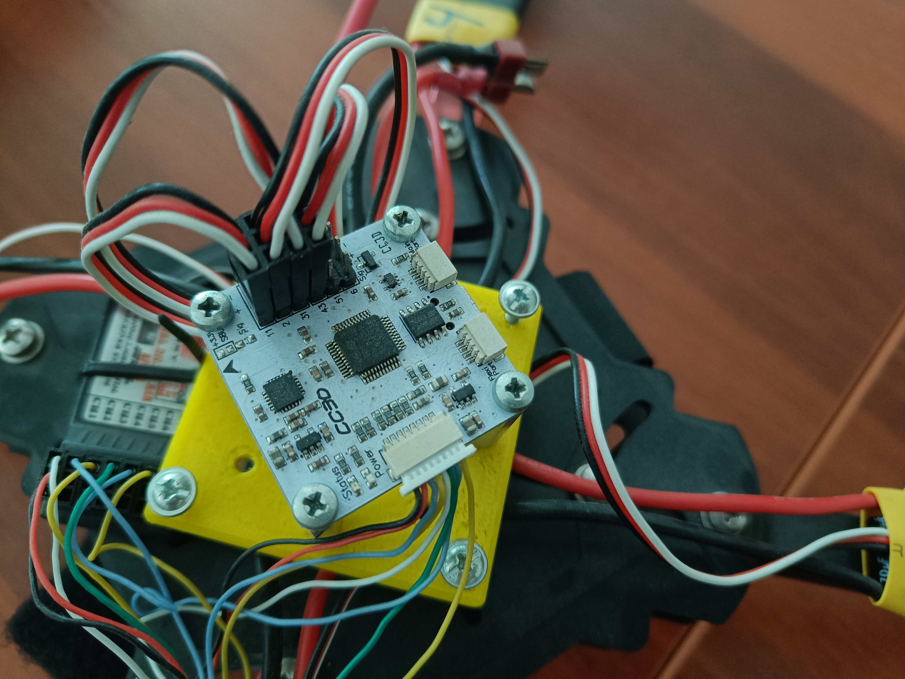

### NXP HoverGames FMUK66 
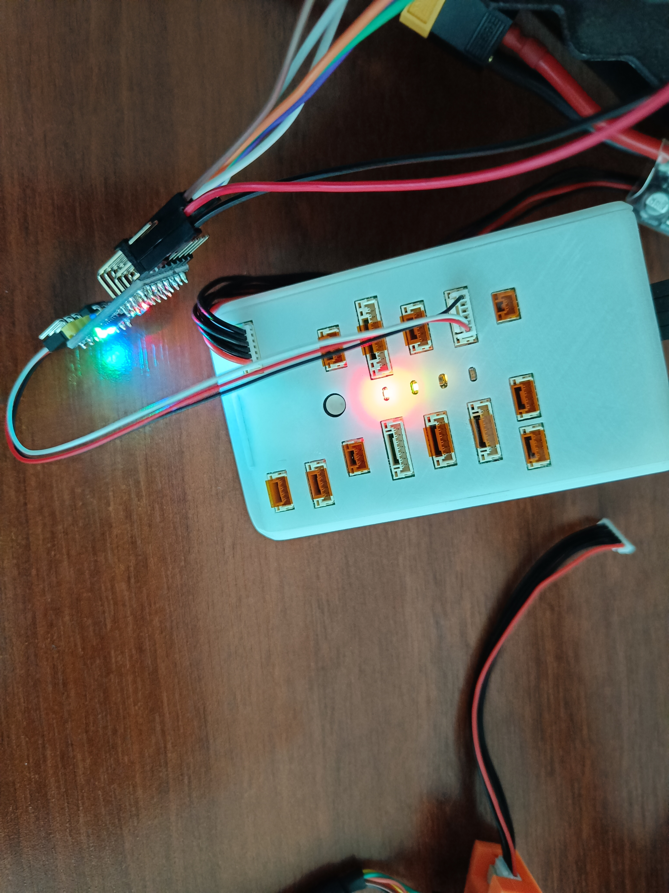

## Drone Testing Platform
### Planning and modeling
In addition to the hardware aspects, I also had to learn a basics of 3D modeling using Autodesk Fusion 360. Building an actual platform required some ahead preperations and planning. The rings of the testing platform were inspired by the principles of a gyroscope, enabling to evaluate the drone's roll, pitch, and yaw. Fusion 360 was a great help.

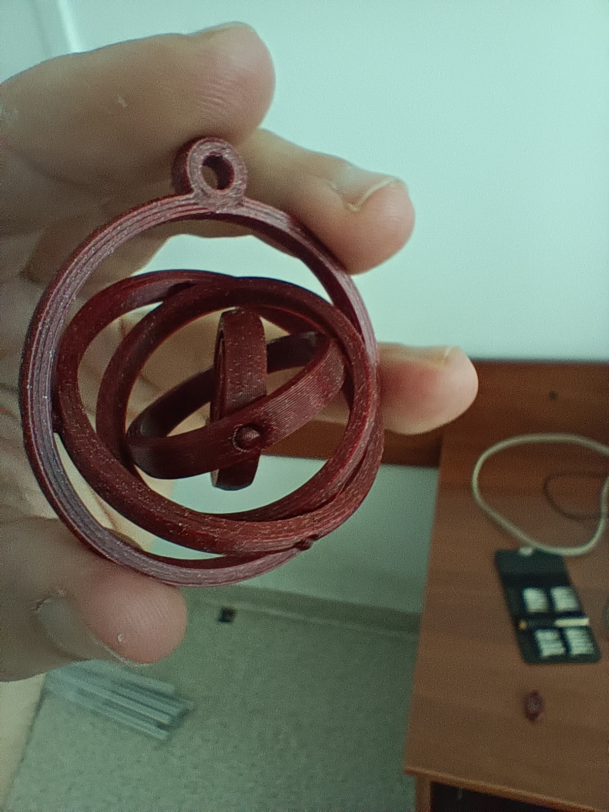
Gyroscope I had printed using a 3d Prusa printer.

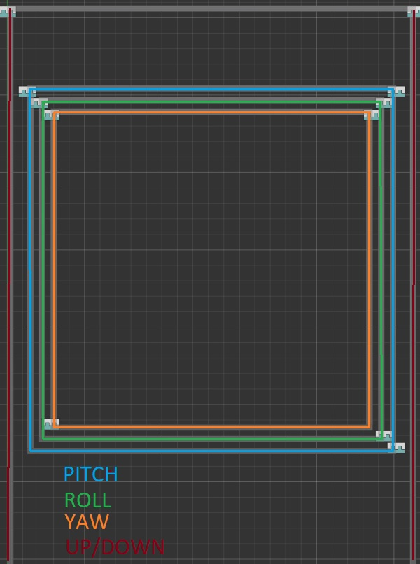  
Modeled rings.

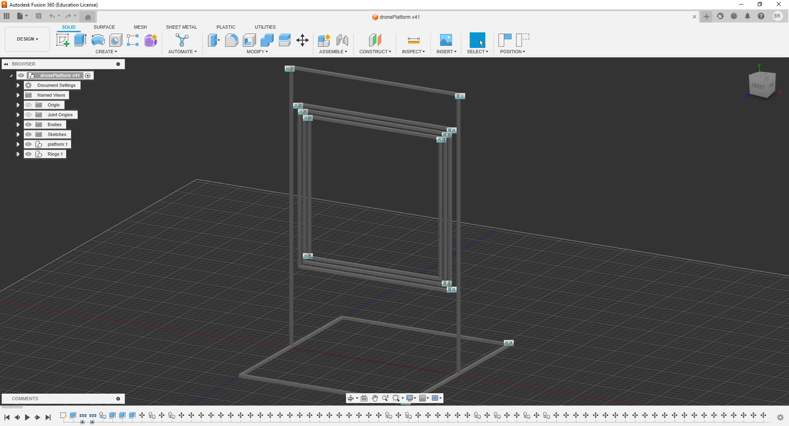
A full 3d model of the drone testing platform.

### Building the platform

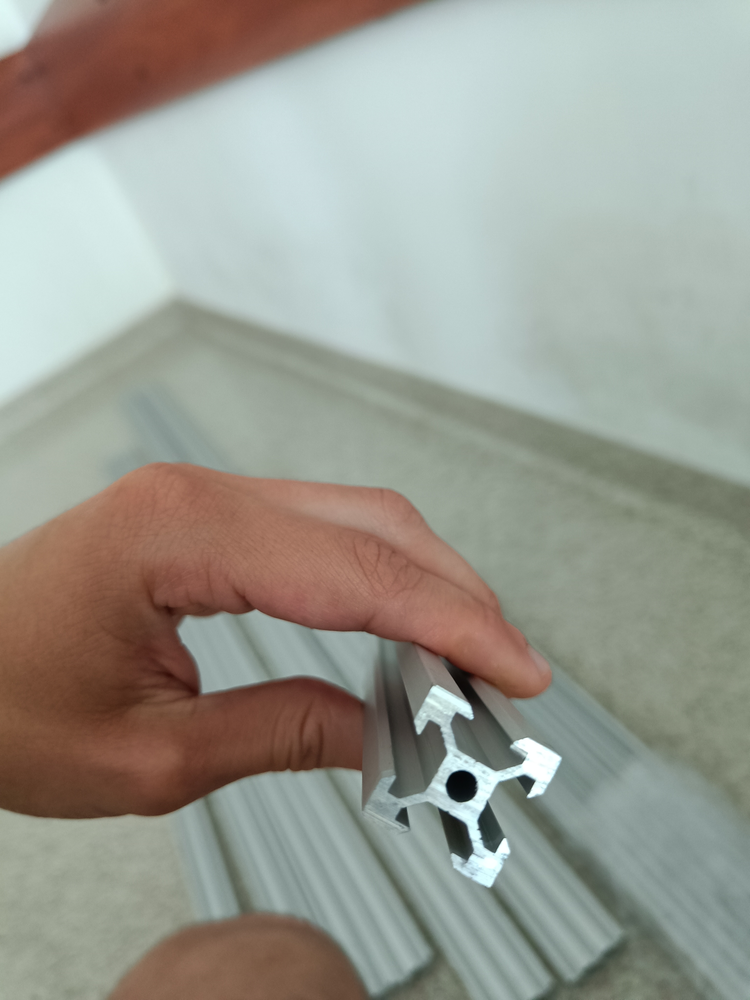
Aluminum x-shape profile 20x20mm.

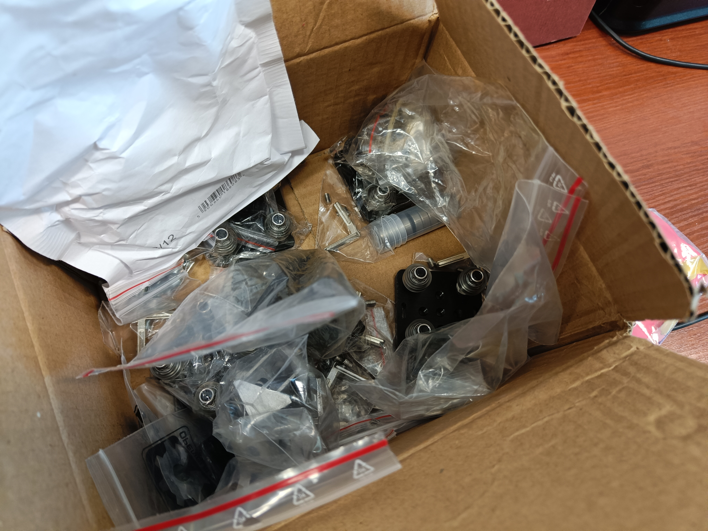
Elements used.

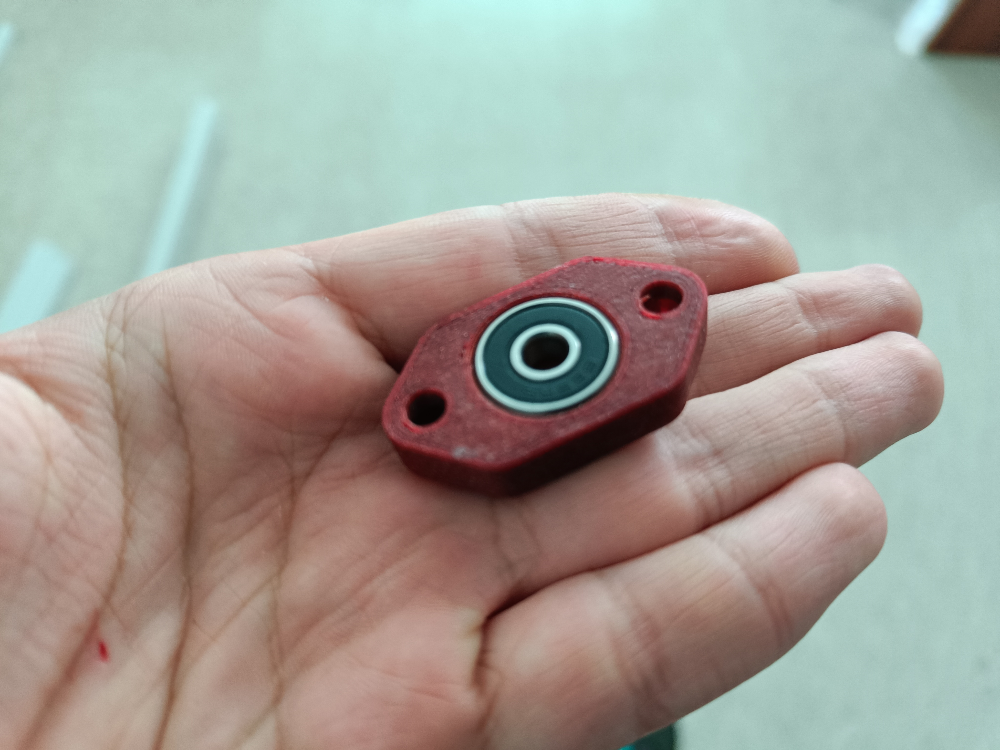
Bearing holder printed with 3d Prusa.

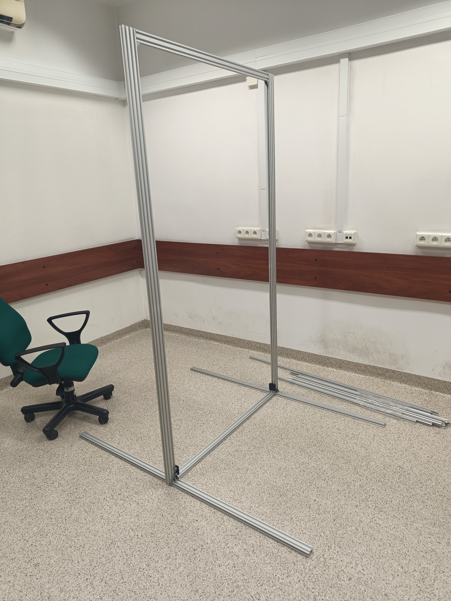
Almost finished platform.

## Programming FMUK66 for first use
To work on this project, I needed to establish a development environment that would allow me to build and flash the drone's firmware and bootloader. Here are the steps I followed:
- Virtual Machine - I created a virtual machine using Ubuntu 20.04 as the operating system.
- QGroundControl - Ground control software. It can be used to flash, configure and control FMU.
- J-Link Software - Used to flash binaries onto the FMUK66 board.

### Building Firmware and Bootloader
The bootloader is a small program that initializes the hardware and loads the firmware onto the device. The firmware, on the other hand, is the software that runs on the device and controls its functionality.

NXP HoverGames already provided a builds to download. Unfortunately, the board I worked with was an older version, so the files to download didn't work. That's why I had to build bootloader and firmware following these tutorials:
- https://nxp.gitbook.io/hovergames/developerguide/building-bootloader
- https://nxp.gitbook.io/hovergames/developerguide/building-firmware

After building the firmware and configuring the bootloader, I flashed them onto the drone's hardware. The flashing process involved:
1. Connectivity: I connected the Ubuntu virtual machine to the drone hardware using the USB interface.

    The HoverGames drone kit includes a J-Link EDU Mini debugger. The debugger can be plugged into the FMU using a small adapter board.
    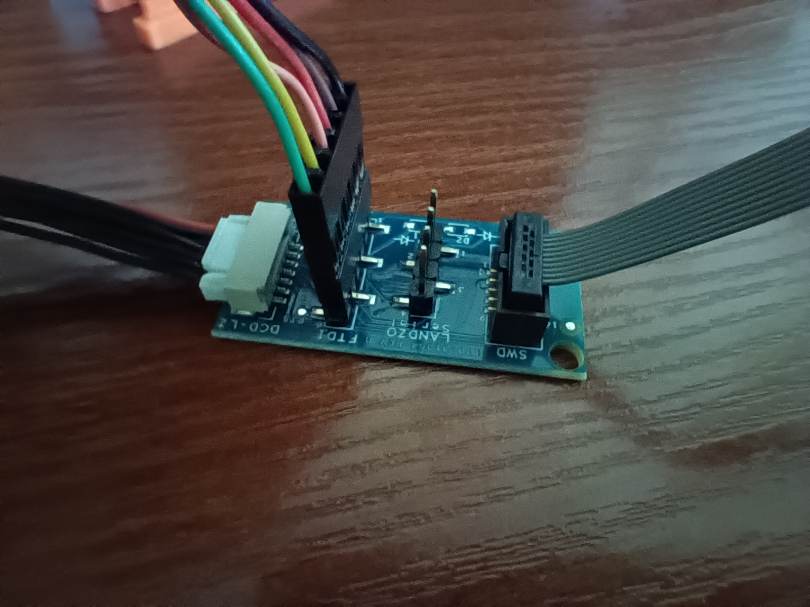
    The J-Link debugger can be connected using an SWD cable.
    
    The photo shows a connected adapter (orange case) with J-link debugger.

2. Flashing Software: Using the J-Link Software, I initiated the flashing process to transfer the firmware and bootloader onto the drone's hardware. The tutorial can be found here: https://nxp.gitbook.io/hovergames/userguide/programming

3. Testing: To ensure the successful deployment of the bootloader and firmware, I had to verify the drone's behavior using the QGroundControl software and a controller. 

## Flying with QGroundControl software
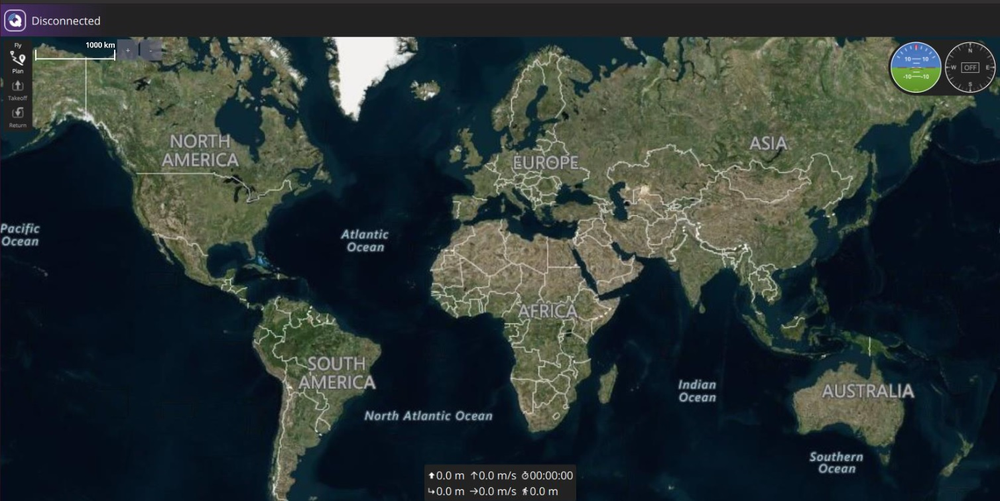

The status of the drone can be seen in the top left corner of the software (right now it's "disconnected"). The drone can have many different statuses like "Ready to Fly", "Armed" etc. When the status is "Ready to Fly", you can change it by clicking on the label and click "Arm" button.

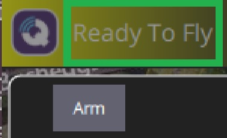

The status changed to "Armed". You can now fly. When the drone is flying, the status also changes to "Flying".

## Flying with the controller
To controll the drone I used FlySky model FS-CT6B.
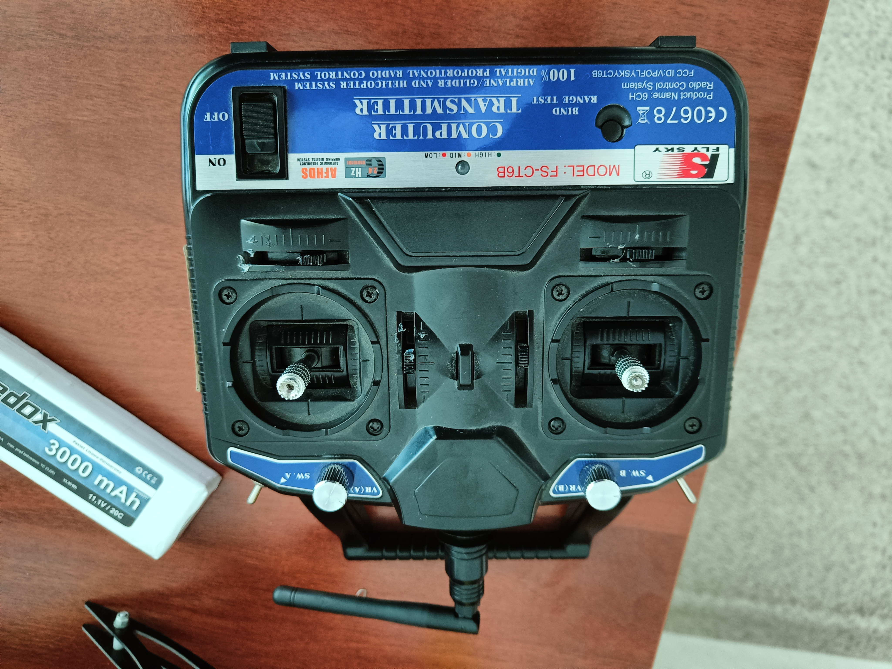

An instruction how I set flying with controller. Switching between "Armed" and "Unarmed" was set to prevent starting a drone by accident.
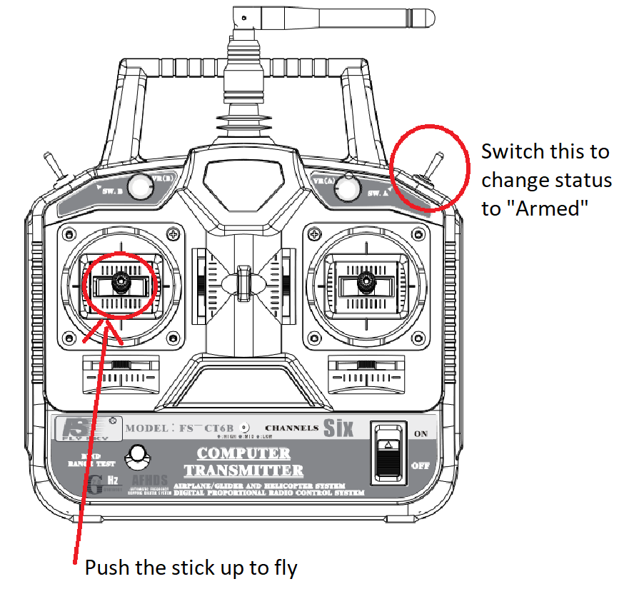

Flysky instruction manual: https://static1.squarespace.com/static/5bc852d6b9144934c40d499c/t/5d245928fffdfb0001cf5dcb/1562663313130/FS-CT6Bmanual.pdf

# Conclusion

This internship was completely different from my previous ones, where I only programmed. I had the opportunity to work on various aspects of drone technology, from hardware modifications, flashing binaries to controller integration. I learned the basics of Autodesk Fusion 360 - it was a great help in building a drone testing platform.

Conclusion: Playing around with hardware is fun.

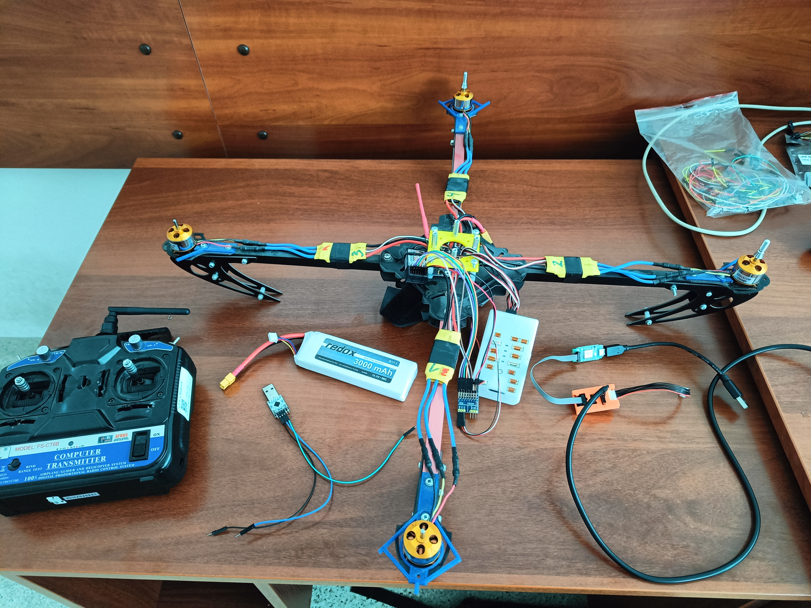